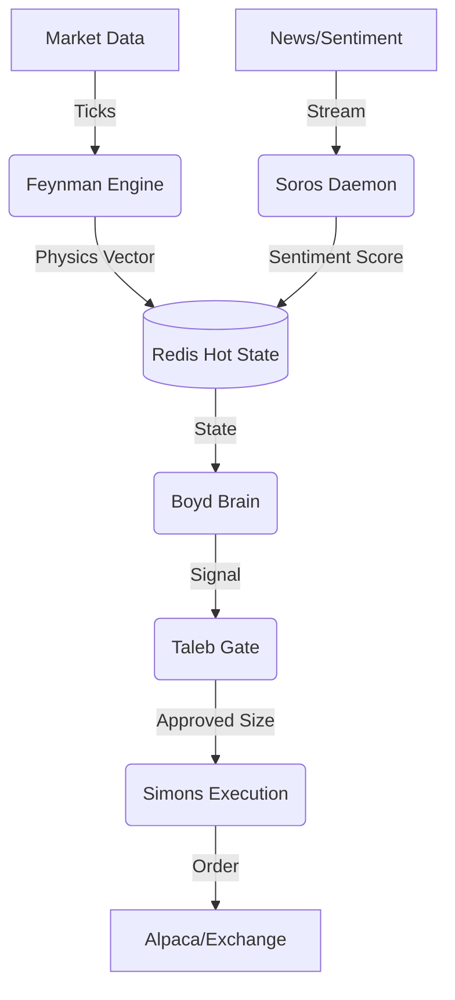

# Data Flow Architecture (v4.0)

## System Overview

```mermaid
graph TD
    Market[Market Data] --> |Ticks| Feynman(Feynman Engine)
    Feynman --> |Physics Vector| Redis[(Redis Hot State)]
    
    News[News/Sentiment] --> |Stream| Soros(Soros Daemon)
    Soros --> |Sentiment Score| Redis
    
    Redis --> |State| Boyd(Boyd Brain)
    
    Boyd --> |Signal| Taleb(Taleb Gate)
    
    Taleb --> |Approved Size| Simons(Simons Execution)
    
    Simons --> |Order| Exchange[Alpaca/Exchange]
```
