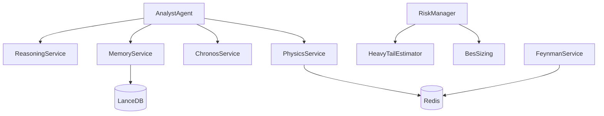

# Service Contracts Specification

**Purpose:** Define input/output schemas, error handling, latency SLAs, and retry policies for all major services.

## 1. PhysicsService

### 1.1 Contract Overview

**Responsibility:** Read real-time physics state from Redis (bridge to FeynmanService)

**Location:** `app/services/physics.py`

**Initialization:**

```python
class PhysicsService:
    def __init__(self):
        # Connects to Redis
        # No parameters required
```

### 1.2 Methods

#### `get_forces(symbol: str) -> Dict[str, float]`

**Purpose:** Fetch 5-Pillar Physics Vector

**Input Schema:**

```python
{
    "symbol": str  # Example: "SPY"
}
```

**Output Schema:**

```python
{
    "mass": float,           # Base inertia (0.0 to 1.0)
    "momentum": float,       # Directional force (-inf to +inf)
    "friction": float,       # Resistance (0.0 to 1.0)
    "entropy": float,        # Disorder (0.0 to 1.0)
    "nash_dist": float,      # Equilibrium distance (0.0 to 1.0)
    "regime": str,           # "Gaussian" | "Lévy Stable" | "Critical"
    "alpha_coefficient": float  # Hill estimator (0.5 to 10.0)
}
```

**Fallback (on error):**

```python
{
    "mass": 0.0,
    "momentum": 0.0,
    "friction": 0.0,
    "entropy": 0.0,
    "nash_dist": 0.0,
    "regime": "WAIT",
    "alpha_coefficient": 2.5  # Conservative default
}
```

**Error Handling:**

- **Redis unavailable**: Returns fallback (fail-safe)
- **Invalid symbol**: Returns fallback
- **Corrupted data**: Logs warning, returns fallback

**Latency SLA:**

- **P50**: <1ms (Redis GET)
- **P95**: <3ms
- **P99**: <10ms

#### `analyze_regime(buffer: List[float]) -> Dict[str, Any]`

**Purpose:** Analyze market regime from price buffer

**Input Schema:**

```python
{
    "buffer": List[float]  # Price history (min 20, max 252)
}
```

**Output Schema:**

```python
{
    "regime": str,   # "Gaussian" | "Lévy Stable" | "Critical"
    "alpha": float   # Hill estimator (0.5 to 10.0)
}
```

**Error Handling:**

- **Insufficient data** (<20 bars): Returns `{"regime": "Gaussian", "alpha": 2.5}`

**Latency SLA:**

- **P50**: <5ms
- **P99**: <20ms

---

## 2. ChronosService

### 2.1 Contract Overview

**Responsibility:** Probabilistic time-series forecasting using Chronos-Bolt

**Location:** `app/services/chronos.py`

**Hardware:** Apple Metal (MPS) or CPU fallback

**Initialization:**

```python
class ChronosService:
    def __init__(
        self,
        model_name: str = "amazon/chronos-bolt-small",
        context_len: int = 512,
        throttle_steps: int = 10
    ):
        # Loads neural model to MPS/CPU
```

### 2.2 Methods

#### `forecast(prices: List[float], horizon: int = 10) -> Dict[str, List[float]]`

**Purpose:** Generate probabilistic forecast

**Input Schema:**

```python
{
    "prices": List[float],  # Historical prices (min 50, max 512)
    "horizon": int          # Forecast steps (default: 10)
}
```

**Output Schema:**

```python
{
    "median": List[float],  # P50 predictions (length = horizon)
    "low": List[float],     # P10 predictions
    "high": List[float],    # P90 predictions
    "metadata": {
        "model": str,       # "chronos-bolt-small"
        "device": str,      # "mps" | "cpu"
        "latency_ms": float
    }
}
```

**Error Handling:**

- **Insufficient data** (<50 bars): Raises `ValueError`
- **Model not loaded**: Raises `RuntimeError`
- **OOM**: Logs error, returns flat forecast (last price repeated)

**Latency SLA:**

- **P50**: 100ms (MPS)
- **P95**: 150ms
- **P99**: 250ms
- **Timeout**: 500ms (fallback to flat forecast)

**Retry Policy:**

- **Attempts**: 1 (no retry, expensive operation)
- **Backoff**: N/A

---

## 3. SentimentAdapter

### 3.1 Contract Overview

**Responsibility:** Financial sentiment analysis via FinBERT (ONNX-accelerated)

**Location:** `app/adapters/sentiment.py`

**Hardware:** ONNX Runtime (CPU-optimized)

### 3.2 Methods

#### `analyze(text: str) -> Dict[str, Any]`

**Purpose:** Classify financial sentiment

**Input Schema:**

```python
{
    "text": str  # News headline or tweet (max 512 chars)
}
```

**Output Schema:**

```python
{
    "label": str,      # "Bullish" | "Neutral" | "Bearish"
    "score": float,    # Confidence (0.0 to 1.0)
    "scores": {
        "bullish": float,
        "neutral": float,
        "bearish": float
    }
}
```

**Error Handling:**

- **Empty text**: Returns `{"label": "Neutral", "score": 0.5}`
- **Model failure**: Logs error, returns neutral sentiment

**Latency SLA:**

- **P50**: 15ms (ONNX)
- **P95**: 25ms
- **P99**: 40ms

**Retry Policy:**

- **Attempts**: 2
- **Backoff**: 100ms exponential

---

## 4. ReasoningService

### 4.1 Contract Overview

**Responsibility:** LLM-based signal generation via Ollama (Llama 3.1)

**Location:** `app/services/reasoning.py`

**Hardware:** CPU (Metal acceleration via Ollama)

### 4.2 Methods

#### `generate_signal(context: Dict[str, Any]) -> Dict[str, Any]`

**Purpose:** Generate trading signal with reasoning

**Input Schema:**

```python
{
    "symbol": str,
    "price": float,
    "physics": {
        "alpha": float,
        "regime": str,
        "momentum": float
    },
    "forecast": {
        "median": List[float],
        "low": List[float],
        "high": List[float]
    },
    "sentiment": {
        "label": str,
        "score": float
    },
    "council_signals": List[Dict]  # From strategies
}
```

**Output Schema:**

```python
{
    "signal": {
        "side": str,        # "BUY" | "SELL" | "FLAT"
        "confidence": float,  # 0.0 to 1.0
        "reasoning": str,   # LLM explanation
        "strategy": str     # Dominant factor
    },
    "metadata": {
        "model": str,       # "llama3.1:8b"
        "latency_ms": float,
        "tokens": int
    }
}
```

**Error Handling:**

- **Ollama unavailable**: Returns `{"side": "FLAT", "confidence": 0.0, "reasoning": "LLM offline"}`
- **Timeout** (>5s): Returns FLAT signal
- **Invalid response**: Retries with simplified prompt

**Latency SLA:**

- **P50**: 1500ms
- **P95**: 3000ms
- **P99**: 5000ms
- **Timeout**: 10000ms

**Retry Policy:**

- **Attempts**: 2
- **Backoff**: 500ms fixed

---

## 5. MemoryService

### 5.1 Contract Overview

**Responsibility:** Vector similarity search for market state embeddings

**Location:** `app/services/memory.py`

**Database:** LanceDB (embedded)

### 5.2 Methods

#### `save_regime(symbol: str, state: Dict, vector: np.ndarray) -> bool`

**Purpose:** Store market state embedding

**Input Schema:**

```python
{
    "symbol": str,
    "state": Dict,         # Physics + sentiment
    "vector": np.ndarray   # 384-dimensional embedding
}
```

**Output Schema:**

```python
bool  # True if successful, False otherwise
```

**Error Handling:**

- **LanceDB unavailable**: Logs error, returns `False`
- **Invalid vector**: Raises `ValueError`

**Latency SLA:**

- **P50**: 10ms
- **P95**: 30ms
- **P99**: 50ms

#### `retrieve_similar(vector: np.ndarray, limit: int = 5) -> List[Dict]`

**Purpose:** Find similar historical states

**Input Schema:**

```python
{
    "vector": np.ndarray,  # Query embedding (384-dim)
    "limit": int           # Top K results (default: 5)
}
```

**Output Schema:**

```python
List[{
    "symbol": str,
    "timestamp": datetime,
    "state": Dict,
    "distance": float  # L2 distance (0.0 = identical)
}]
```

**Error Handling:**

- **Empty table**: Returns empty list `[]`
- **Search failure**: Logs error, returns `[]`

**Latency SLA:**

- **P50**: 130ms (ANN search)
- **P95**: 200ms
- **P99**: 350ms

**Retry Policy:**

- **Attempts**: 1 (no retry, fails gracefully)

---

## 6. MarketScanner

### 6.1 Contract Overview

**Responsibility:** Dynamic universe selection from full US equity market

**Location:** `app/services/scanner.py`

### 6.2 Methods

#### `get_active_universe(limit: int = 20) -> List[str]`

**Purpose:** Get Top N volatile/liquid assets

**Input Schema:**

```python
{
    "limit": int  # Number of symbols to return (default: 20)
}
```

**Output Schema:**

```python
List[str]  # Example: ["NVDA", "TSLA", "AMD", ...]
```

**Fallback (on error):**

```python
["SPY", "QQQ"]  # Safe defaults
```

**Error Handling:**

- **Alpaca API down**: Returns fallback
- **Empty results**: Returns fallback
- **Timeout**: Cache hit or fallback

**Latency SLA:**

- **P50**: 1100ms (cold, full scan)
- **P50**: 0ms (cached, <5min TTL)
- **P95**: 2000ms (cold)

**Cache:**

- **TTL**: 300 seconds (5 minutes)
- **Invalidation**: Age-based only

**Retry Policy:**

- **Attempts**: 2
- **Backoff**: 1000ms linear

---

## 7. RiskManager

### 7.1 Contract Overview

**Responsibility:** Position sizing with Physics Veto

**Location:** `app/agent/risk/manager.py` (implied)

### 7.2 Methods

#### `calculate_position_size(forecast: Dict, alpha: float, price: float) -> float`

**Purpose:** BES position sizing with Physics Veto

**Input Schema:**

```python
{
    "forecast": {
        "median": List[float],
        "low": List[float],
        "high": List[float]
    },
    "alpha": float,  # Hill estimator
    "price": float   # Current market price
}
```

**Output Schema:**

```python
float  # Position size (0.0 to 0.20)
```

**Special Cases:**

- **Alpha < 2.0**: Returns `0.0` (VETO)
- **Negative E[R]**: Returns `0.0`
- **ES <= 0**: Returns `0.0`

**Latency SLA:**

- **P50**: <1ms (pure computation)
- **P99**: <5ms

---

## 8. Cross-Service Dependencies

### 8.1 Dependency Graph



### 8.2 Failure Cascade Prevention

**Circuit Breaker Pattern:**

```python
from circuitbreaker import circuit

@circuit(failure_threshold=5, recovery_timeout=60)
def call_llm_service(prompt):
    return ollama.chat(prompt)
```

**Fallback Chain:**

1. **Primary**: Ollama LLM
2. **Secondary**: Rule-based signal (if LLM fails)
3. **Tertiary**: FLAT signal (if rules fail)

---

## 9. Monitoring & SLA Tracking

### 9.1 Service Health Metrics

**Per-Service:**

- `{service}_latency_ms` (histogram)
- `{service}_errors_total` (counter)
- `{service}_success_rate` (gauge)

**Example:**

```python
from app.core.metrics import service_latency_histogram

with service_latency_histogram.labels(service="chronos").time():
    forecast = chronos_service.forecast(prices)
```

### 9.2 SLA Violation Alerts

**Thresholds:**

- 🚨 **CRITICAL**: P95 > 2x SLA for 5 consecutive minutes
- ⚠️ **WARNING**: P95 > 1.5x SLA for 2 minutes

**Example:**

- ChronosService P95 > 300ms (SLA: 150ms) → WARNING
- ChronosService P95 > 450ms → CRITICAL

---

## 10. Testing Contracts

### 10.1 Unit Test Template

```python
def test_physics_service_get_forces():
    # Arrange
    service = PhysicsService()
    
    # Act
    forces = service.get_forces("SPY")
    
    # Assert
    assert "alpha_coefficient" in forces
    assert 0.5 <= forces["alpha_coefficient"] <= 10.0
    assert forces["regime"] in ["Gaussian", "Lévy Stable", "Critical", "WAIT"]
```

### 10.2 Integration Test Template

```python
async def test_analyst_to_risk_flow():
    # Arrange
    analyst = AnalystAgent()
    risk = RiskManager()
    
    # Act
    signal = await analyst.generate_signal()
    size = risk.calculate_position_size(signal)
    
    # Assert
    assert 0.0 <= size <= 0.20  # Hard cap
```

---

## 11. Versioning & Deprecation

### 11.1 Contract Versioning

**Pattern:** Semantic versioning for breaking changes

```python
class PhysicsService:
    VERSION = "2.0.0"  # Major.Minor.Patch
    
    def get_forces_v2(self, symbol: str) -> Dict:
        # New contract (added fields)
        pass
    
    @deprecated(version="3.0.0", reason="Use get_forces_v2")
    def get_forces(self, symbol: str) -> Dict:
        # Legacy contract
        pass
```

### 11.2 Deprecation Timeline

1. **Announce**: Add `@deprecated` decorator
2. **Grace Period**: 30 days minimum
3. **Remove**: Delete in next major version

---

## 12. Performance Benchmarks

### 12.1 Latency Budget (End-to-End)

**Tick → Execution:**

| Stage | Service | Budget | Actual (P50) |
|-------|---------|--------|--------------|
| 1. Ingest | IngestService | 50ms | 30ms |
| 2. Physics | FeynmanService | 50ms | 40ms |
| 3. Forecast | ChronosService | 150ms | 100ms |
| 4. Reasoning | ReasoningService | 2000ms | 1500ms |
| 5. Risk | RiskManager | 10ms | 5ms |
| 6. Execution | SimonsAgent | 200ms | 150ms |
| **Total** | - | **2460ms** | **1825ms** ✅ |

**Budget Headroom:** ~25%

### 12.2 Throughput

**Max Throughput (per service):**

- PhysicsService: 1000 req/sec (Redis-bound)
- ChronosService: 10 req/sec (GPU-bound)
- ReasoningService: 1 req/sec (LLM-bound)

**Actual Load:**

- PhysicsService: ~10 req/sec (10% capacity)
- ChronosService: ~1 req/min (1% capacity)
- ReasoningService: ~1 req/min (100% capacity) ⚠️

**Bottleneck:** ReasoningService (LLM)

---

## 13. Future Enhancements

- [ ] **gRPC** for inter-service communication (replace HTTP)
- [ ] **Protocol Buffers** for schema validation
- [ ] **Service Mesh** (Linkerd) for observability
- [ ] **Rate Limiting** per service (token bucket)
- [ ] **Request Tracing** (OpenTelemetry)

---

## 14. BrainService (Protobuf / gRPC)

### 14.1 Contract Overview

**Responsibility:** High-performance AI Inference (Forecasting & Sentiment).
**Protocol:** gRPC (Protobuf).
**Definition:** `protos/brain.proto`.

### 14.2 Methods

#### `Forecast(ForecastRequest) -> ForecastResponse`

**Input:** `ticker` (str), `prices` (double[]), `horizon` (int32)
**Output:** `p10` (double[]), `p50` (double[]), `p90` (double[])

#### `AnalyzeSentiment(SentimentRequest) -> SentimentResponse`

**Input:** `headlines` (string[])
**Output:** `sentiment_score` (double), `confidence` (double)

---

## 15. BacktestController (Streaming)

### 15.1 Contract Overview

**Responsibility:** Simulation Orchestration & Telemetry.
**Protocol:** REST (Control) + WebSocket (Data).

### 15.2 Endpoints

#### `POST /api/backtest/spawn`

**Input:** `{"start_date": "YYYY-MM-DD", "end_date": "YYYY-MM-DD"}`
**Output:** `{"run_id": "RUN_...", "status": "spawned"}`

#### `WS /api/backtest/stream/{run_id}`

**Frames (Server -> Client):**

```json
{
  "type": "progress",
  "progress": 0.45,  // 0.0 to 1.0
  "equity": 10500.0,
  "timestamp": "ISO8601"
}
```

**Frames (Completion):**

```json
{
  "type": "COMPLETED",
  "metrics": { "total_return": 0.12, "sharpe": 1.5, ... }
}
```

## 16. Telemetry Contract ("The Inner Loop")

### 16.1 Contract Overview

**Responsibility:** Granular visibility into the Agent's Cognitive Cycle (OODA Loop).
**Format:** Structured Log (human-readable + machine-parsable via `[INNER LOOP]` and Emoji tags).
**Level:** `INFO` (Production Safe).

### 16.2 Log Schemas

#### 16.2.1 Pipeline Stages

| Stage | Tag | Format Example |
| :--- | :--- | :--- |
| **Soros** | `🌀` | `🌀 [INNER LOOP] 1. SOROS: Scanning Regime (Cycle {id})...` |
| **Boyd** | `🤔` | `🤔 [INNER LOOP] 2. BOYD: Executing OODA Loop (Cycle {id})...` |
| **Nash** | `⚖️` | `⚖️ [INNER LOOP] 2.5. NASH: Auditing Equilibrium (Cycle {id})...` |
| **Taleb** | `🦢` | `🦢 [INNER LOOP] 3. TALEB: Calculating Risk (Cycle {id})...` |
| **Simons** | `🔢` | `🔢 [INNER LOOP] 4. SIMONS: Processing Execution (Cycle {id})...` |

#### 16.2.2 Boyd (OODA Vector)

```python
# Format
f"🧠 [INNER LOOP] OODA Calc | Momentum={m:.2f} Jerk={j:.2f} Reflexivity={r:.2f} Dampener={d} -> Urgency={u:.2f}"

# Example
"🧠 [INNER LOOP] OODA Calc | Momentum=0.85 Jerk=1.10 Reflexivity=0.45 Dampener=1.0 -> Urgency=0.92"
```

#### 16.2.3 Boyd (Council Votes)

```python
# Format
f"🗳️ [INNER LOOP] Council of Giants Votes: {strat1}={vote1}, {strat2}={vote2}..."

# Example
"🗳️ [INNER LOOP] Council of Giants Votes: LSTM=0.8, MeanRev=-0.2, Quantum=0.5"
```

#### 16.2.4 Chronos (Forecast)

```python
# Format
f"🔮 [INNER LOOP] CHRONOS FORECAST: Signal={side} Conf={conf:.2f} Horizon={h}"

# Example
"🔮 [INNER LOOP] CHRONOS FORECAST: Signal=BUY Conf=0.92 Horizon=12"
```

#### 16.2.5 Nash (Equilibrium Audit)

```python
# Format (Approved)
f"⚖️ [INNER LOOP] NASH APPROVED: {symbol}. Nash Dist: {dist:.2f}σ"

# Format (Veto)
f"⚖️ [INNER LOOP] NASH VETO: {symbol} {signal} -> {reason}"
```

#### 16.2.6 Hypatia (Ingestion)

```python
# Format
f"📜 [INNER LOOP] Hypatia: Ingesting Telemetry for Run {id}..."
```

---

## 17. The Kepler Protocol (Unique Pulse)

### 17.1 Contract Overview

**Responsibility:** Enforce uniqueness of market observation windows to prevent "Echo Trading".
**Mechanism:** UUID4 Fingerprinting.

### 17.2 The Payload

```python
class KeplerPayload(BaseModel):
    scan_id: UUID4       # Unique Fingerprint (Prevent Echos)
    timestamp: datetime  # Pulse Time
    count: int           # Asset Count
    universe: list       # Candidate Assets
```

### 17.3 The Veto Logic

1. **Scanner** emits `KeplerPayload` with `scan_id=UUID4()`.
2. **Soros** checks `state["last_scan_id"]`.
3. If `scan_id == last_scan_id`: **VETO** (Sleep).
4. Else: **PROCEED** and update `last_scan_id`.
