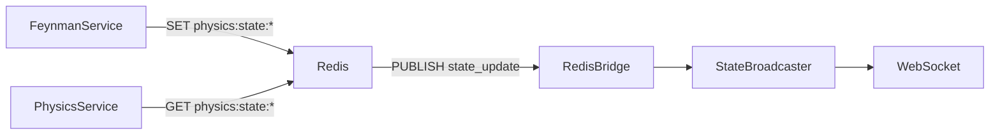

# API Specification: Redis Protocol & Key Patterns

**Purpose:** Internal state management and pub/sub messaging  
**Redis Version:** 7.x  
**Client Library:** `redis-py` (Python), `ioredis` (Node.js)

## 1. Architecture Overview

Redis serves **three critical roles** in Curiosity Cottage:

1. **State Store**: Synchronized physics state across services
2. **Message Bus**: Real-time event pub/sub
3. **Cache**: Fast-access market data



## 2. Key Patterns

### 2.1 Physics State

**Pattern:** `physics:state:{symbol}`

**Purpose:** Store real-time 5-Pillar Physics Vector

**Data Type:** String (JSON serialized)

**Schema:**

```json
{
  "mass": 0.42,
  "momentum": 1.23,
  "friction": 0.15,
  "entropy": 0.08,
  "nash_dist": 0.05,
  "regime": "Gaussian",
  "alpha_coefficient": 2.8
}
```

**TTL:** None (persistent until overwritten)

**Access Pattern:**

- **Writer:** `FeynmanService` (every tick, ~1Hz)
- **Readers:** `PhysicsService`, `RiskManager`, `AnalystAgent`

**Commands:**

```python
# Write
await redis.set(
    f"physics:state:{symbol}",
    orjson.dumps(physics_vector)
)

# Read
data = redis.get(f"physics:state:{symbol}")
if data:
    state = orjson.loads(data)
```

### 2.2 Market Snapshot (Future)

**Pattern:** `market:snapshot:{symbol}`

**Purpose:** Cached market data (price, volume, OHLC)

**Data Type:** Hash

**Schema:**

```redis
HSET market:snapshot:SPY 
  price 450.32
  volume 89234567
  bid 450.31
  ask 450.33
  timestamp 1703174400
```

**TTL:** 60 seconds (stale data protection)

**Commands:**

```python
# Write
redis.hset(f"market:snapshot:{symbol}", mapping={
    "price": price,
    "volume": volume,
    "timestamp": time.time()
})
redis.expire(f"market:snapshot:{symbol}", 60)

# Read
snapshot = redis.hgetall(f"market:snapshot:{symbol}")
```

### 2.3 Agent State (Future)

**Pattern:** `agent:state:{agent_id}`

**Purpose:** Persistent agent memory/context

**Data Type:** String (JSON)

**TTL:** 3600 seconds (1 hour)

## 3. Pub/Sub Channels

### 3.1 State Updates

**Channel:** `state_update`

**Purpose:** Broadcast real-time system state changes

**Publisher:** `FeynmanService`, `AnalystAgent`

**Subscribers:** `RedisBridge` → `StateBroadcaster` → WebSocket clients

**Message Format:**

```json
{
  "event": "PHYSICS_UPDATE",
  "symbol": "SPY",
  "timestamp": "2025-12-21T12:00:00Z",
  "data": {
    "alpha": 2.8,
    "regime": "Gaussian"
  }
}
```

**Commands:**

```python
# Publish
await redis.publish(
    "state_update",
    orjson.dumps(message)
)

# Subscribe
pubsub = redis.pubsub()
await pubsub.subscribe("state_update")

async for message in pubsub.listen():
    if message["type"] == "message":
        data = orjson.loads(message["data"])
        handle_update(data)
```

### 3.2 Trade Signals (Future)

**Channel:** `trade_signals`

**Purpose:** Broadcast buy/sell decisions

**Publisher:** `ReasoningService`

**Subscribers:** `ExecutionAgent`, `AuditLogger`

## 4. Data Structures

### 4.1 Lists (FIFO Queues)

**Pattern:** `queue:tasks`

**Purpose:** Async task queue (not currently used, but reserved)

**Commands:**

```python
# Producer
redis.lpush("queue:tasks", task_json)

# Consumer (blocking)
task = redis.brpop("queue:tasks", timeout=1)
```

### 4.2 Sorted Sets (Leaderboards)

**Pattern:** `leaderboard:strategies`

**Purpose:** Rank strategies by Sharpe Ratio (future)

**Commands:**

```python
# Update score
redis.zadd("leaderboard:strategies", {
    "KalmanMomentum": 1.85,
    "BollingerReversion": 1.23
})

# Get top 5
top5 = redis.zrevrange("leaderboard:strategies", 0, 4, withscores=True)
```

## 5. Connection Configuration

### 5.1 Python (`redis-py`)

```python
import redis.asyncio as redis
import os

redis_client = redis.from_url(
    os.getenv("REDIS_URL", "redis://localhost:6379"),
    decode_responses=True,  # Auto-decode bytes to str
    socket_connect_timeout=5,
    socket_keepalive=True
)
```

### 5.2 Node.js (`ioredis`)

```javascript
const Redis = require('ioredis');

const redis = new Redis({
  host: process.env.REDIS_HOST || 'localhost',
  port: process.env.REDIS_PORT || 6379,
  retryStrategy: (times) => {
    return Math.min(times * 50, 2000);
  }
});
```

## 6. Performance Characteristics

### 6.1 Latency

| Operation | P50 | P95 | P99 |
|-----------|-----|-----|-----|
| GET (hit) | 0.1ms | 0.3ms | 0.5ms |
| SET | 0.2ms | 0.4ms | 0.8ms |
| PUBLISH | 0.3ms | 0.6ms | 1.2ms |

**Network:** Localhost Docker (negligible)

### 6.2 Throughput

- **Max Ops/sec**: ~100k (Redis 7.x single-threaded)
- **Current Load**: ~100 ops/sec (well below capacity)
- **Bottleneck**: Not Redis (application logic)

## 7. Persistence & Durability

### 7.1 RDB (Snapshotting)

**Frequency:** Every 60 seconds if ≥100 writes

```redis
SAVE 60 100
```

**File:** `dump.rdb`

### 7.2 AOF (Append-Only File)

**Mode:** `everysec` (write to disk every second)

```redis
appendonly yes
appendfsync everysec
```

**Trade-off:** 1 second of data loss max on crash

### 7.3 Backup Strategy

**Current:** Docker volume persistence

**Production Recommendation:**

- Daily RDB snapshots to S3
- AOF replication to standby instance

## 8. Security

### 8.1 Authentication

**Current:** No password (localhost only)

**Production:**

```redis
requirepass <strong-password>
```

**Client Connection:**

```python
redis_client = redis.from_url("redis://:password@localhost:6379")
```

### 8.2 Network

**Current:** Exposed only to Docker network

**Firewall Rule:**

```
iptables -A INPUT -p tcp --dport 6379 -s 127.0.0.1 -j ACCEPT
iptables -A INPUT -p tcp --dport 6379 -j DROP
```

## 9. Monitoring & Debugging

### 9.1 CLI Inspection

**Monitor all commands in real-time:**

```bash
redis-cli MONITOR
```

**Get specific key:**

```bash
redis-cli GET "physics:state:SPY"
```

**List all keys matching pattern:**

```bash
redis-cli KEYS "physics:state:*"
```

**Watch pub/sub:**

```bash
redis-cli SUBSCRIBE state_update
```

### 9.2 Metrics

**Server stats:**

```bash
redis-cli INFO stats
```

**Key metrics:**

- `total_commands_processed`: Lifetime commands
- `instantaneous_ops_per_sec`: Current load
- `used_memory_human`: RAM usage
- `connected_clients`: Active connections

### 9.3 Slow Log

**Enable:**

```redis
CONFIG SET slowlog-log-slower-than 10000  # 10ms
```

**View:**

```bash
redis-cli SLOWLOG GET 10
```

## 10. Error Handling

### 10.1 Connection Loss

**Symptom:** `ConnectionError: Error while reading from socket`

**Client Behavior:**

- Automatic reconnection with exponential backoff
- Queue operations until reconnected

**Code:**

```python
try:
    data = await redis.get(key)
except redis.ConnectionError:
    logger.error("Redis unavailable, using fallback")
    data = fallback_value
```

### 10.2 Memory Pressure

**Symptom:** `OOM command not allowed when used memory > 'maxmemory'`

**Eviction Policy:** `allkeys-lru` (Least Recently Used)

```redis
maxmemory 256mb
maxmemory-policy allkeys-lru
```

## 11. Key Naming Conventions

### 11.1 Hierarchy

Use colon (`:`) as namespace separator:

```
<domain>:<entity>:<identifier>
```

**Examples:**

- `physics:state:SPY`
- `market:snapshot:AAPL`
- `agent:state:analyst_001`

### 11.2 Case

- **Domains:** lowercase (`physics`, `market`)
- **Identifiers:** UPPERCASE (`SPY`, `AAPL`)

### 11.3 Avoid

- ❌ Spaces: `physics state` → Use `physics:state`
- ❌ Special chars: `physics/state` → Use `physics:state`
- ❌ Long keys: `very_long_descriptive_key_name` → Keep concise

## 12. Operational Runbook

### 12.1 Flush All Data (Reset)

```bash
redis-cli FLUSHALL
```

**Use case:** System reset, testing

### 12.2 Delete Specific Pattern

```bash
redis-cli --scan --pattern "physics:state:*" | xargs redis-cli DEL
```

### 12.3 Export Data

```bash
redis-cli --rdb dump.rdb
```

### 12.4 Import Data

```bash
redis-cli --pipe < dump.rdb
```

## 13. Scaling Considerations

### 13.1 Current Deployment

- **Mode:** Single instance
- **RAM:** 256 MB
- **Clients:** ~5 (Engine, Physics, Feynman, BFF, RedisBridge)

### 13.2 Future (If Needed)

**Redis Cluster** (horizontal scaling):

- 3+ nodes with data sharding
- Automatic failover

**Redis Sentinel** (high availability):

- Master-replica setup
- Automatic promotion on master failure

## 14. References

- [Redis Command Reference](https://redis.io/commands)
- [redis-py Documentation](https://redis-py.readthedocs.io/)
- [Redis Persistence](https://redis.io/topics/persistence)
- [Redis Pub/Sub](https://redis.io/topics/pubsub)
