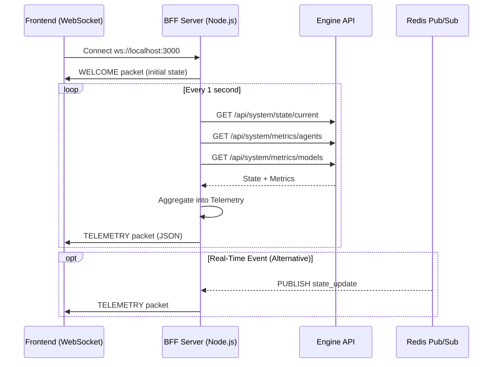

# API Specification: WebSocket Protocol

**Endpoint:** `ws://localhost:8000/ws/stream`  
**Protocol:** WebSocket (RFC 6455)  
**Serialization:** JSON (orjson for performance)

## 1. Connection Flow

### 1.1 Handshake

**Client Request:**

```http
GET /ws/stream HTTP/1.1
Host: localhost:8000
Upgrade: websocket
Connection: Upgrade
Sec-WebSocket-Key: <base64-encoded-key>
Sec-WebSocket-Version: 13
```

**Server Response:**

```http
HTTP/1.1 101 Switching Protocols
Upgrade: websocket
Connection: Upgrade
Sec-WebSocket-Accept: <computed-accept-key>
```

### 1.2 On Connect

Upon successful connection, the server:

1. Subscribes client to internal `StateBroadcaster`
2. Starts `RedisBridge` (if not already running)
3. Begins streaming real-time state updates

**Server Log:**

```
INFO: 🧠 BrainStream: Client Connected
```

## 2. Message Protocol

### 2.1 Server → Client (Real-Time Updates)

**Message Type:** `TELEMETRY`

**Schema:**

```json
{
  "type": "TELEMETRY",
  "data": {
    "timestamp": "2025-12-21T12:00:00Z",
    "status": "ACTIVE",
    "market": {
      "symbol": "SPY",
      "price": 450.32,
      "alpha": 2.8,
      "regime": "Lévy Stable",
      "velocity": 0.0012,
      "acceleration": 0.00003
    },
    "portfolio": {
      "nav": 105234.56,
      "cash": 85000.00,
      "daily_pnl": 1234.56,
      "max_drawdown": -0.05
    },
    "signal": {
      "side": "BUY",
      "confidence": 0.85,
      "reasoning": "Momentum + Forecast alignment"
    },
    "governance": {
      "approved_size": 0.15
    },
    "logs": [
      {
        "level": "INFO",
        "message": "Physics: Gaussian regime confirmed",
        "timestamp": "2025-12-21T11:59:58Z"
      }
    ],
    "agents": {
      "MacroAgent": {
        "latency_ms": 45.2,
        "success_rate": 0.98
      }
    },
    "models": {
      "ChronosService": {
        "latency_ms": 120.5,
        "invocations": 1523
      }
    }
  }
}
```

**Update Frequency:** ~1 second (BFF polling interval)

### 2.2 Client → Server (Commands)

**Message Type:** `PING` (Keepalive)

```json
{
  "type": "PING"
}
```

**Server Response:** (None, connection maintained)

**Future Commands** (Not yet implemented):

- `{"type": "SUBSCRIBE", "symbol": "AAPL"}` - Change active symbol
- `{"type": "HALT"}` - Emergency stop

## 3. Telemetry Packet Specification

### 3.1 Top-Level Fields

| Field | Type | Description |
|-------|------|-------------|
| `timestamp` | ISO8601 string | Server timestamp of state snapshot |
| `status` | enum | System status: `ACTIVE`, `HALT`, `INITIALIZING` |

### 3.2 Market Object

| Field | Type | Units | Description |
|-------|------|-------|-------------|
| `symbol` | string | - | Active ticker (e.g., "SPY") |
| `price` | float | USD | Current market price |
| `alpha` | float | - | Hill estimator tail index |
| `regime` | enum | - | "Gaussian", "Lévy Stable", "Critical" |
| `velocity` | float | $/period | Kalman velocity estimate |
| `acceleration` | float | $/period² | Kalman acceleration |

### 3.3 Portfolio Object

| Field | Type | Units | Description |
|-------|------|-------|-------------|
| `nav` | float | USD | Net Asset Value |
| `cash` | float | USD | Available cash |
| `daily_pnl` | float | USD | Today's P&L |
| `max_drawdown` | float | fraction | Maximum drawdown from peak (e.g., -0.05 = -5%) |

### 3.4 Signal Object

| Field | Type | Description |
|-------|------|-------------|
| `side` | enum | "BUY", "SELL", "FLAT" |
| `confidence` | float | Signal confidence (0.0 to 1.0) |
| `reasoning` | string | LLM-generated explanation |

### 3.5 Governance Object

| Field | Type | Units | Description |
|-------|------|-------|-------------|
| `approved_size` | float | fraction | Position size after Physics Veto (0.0 to 0.20) |

### 3.6 Logs Array

```json
[
  {
    "level": "INFO" | "WARNING" | "ERROR",
    "message": "Human-readable log message",
    "timestamp": "ISO8601"
  }
]
```

### 3.7 Agents Object (Performance Metrics)

```json
{
  "AgentName": {
    "latency_ms": float,
    "success_rate": float,  // 0.0 to 1.0
    "invocations": int
  }
}
```

### 3.8 Models Object (Neural Performance)

```json
{
  "ModelName": {
    "latency_ms": float,
    "invocations": int,
    "cache_hit_rate": float  // Optional
  }
}
```

## 4. Data Flow Architecture



## 5. Error Handling

### 5.1 Connection Errors

**Scenario:** Backend unavailable

**Client Behavior:**

- Exponential backoff reconnection (1s, 2s, 4s, 8s, max 30s)
- Display "Disconnected" UI state

**Server Log:**

```
WARNING: 🧠 BrainStream: Connection Closed (Connection reset by peer)
```

### 5.2 Malformed Messages

**Server Behavior:** Log and ignore

```python
logger.debug(f"🧠 BrainStream: Received {data}")
```

### 5.3 Client Disconnect

**Server Cleanup:**

1. Unsubscribe from `StateBroadcaster`
2. Close WebSocket gracefully

**Server Log:**

```
INFO: 🧠 BrainStream: Client Disconnected
```

## 6. Performance Characteristics

### 6.1 Latency

| Metric | Value | Notes |
|--------|-------|-------|
| **Connection Establishment** | ~50ms | Handshake overhead |
| **Message Serialization** | ~0.1ms | orjson (C-optimized) |
| **Network RTT** | ~10ms | localhost |
| **Total Latency** | ~60ms | End-to-end update |

### 6.2 Throughput

- **Message Size**: ~2-5 KB per TELEMETRY packet
- **Frequency**: 1 Hz (1 message/second)
- **Bandwidth**: ~5 KB/s per client

## 7. Security Considerations

### 7.1 Authentication (Not Implemented)

**Current:** No authentication (localhost only)

**Future:** JWT token in `Sec-WebSocket-Protocol` header

```http
Sec-WebSocket-Protocol: token, <JWT>
```

### 7.2 Rate Limiting

**Current:** None

**Recommendation:** Limit to 10 connections per IP

### 7.3 CORS

**Current:** BFF allows all origins (`cors()`)

**Production:** Restrict to frontend domain

## 8. Client Implementation Example

### 8.1 JavaScript (React)

```javascript
const ws = new WebSocket('ws://localhost:3000');

ws.onopen = () => {
  console.log('🧠 Connected to Curiosity Cottage');
};

ws.onmessage = (event) => {
  const packet = JSON.parse(event.data);
  
  if (packet.type === 'WELCOME') {
    console.log('Initial state:', packet.data);
  } else if (packet.type === 'TELEMETRY') {
    updateDashboard(packet.data);
  }
};

ws.onerror = (error) => {
  console.error('WebSocket error:', error);
};

ws.onclose = () => {
  console.log('Disconnected. Reconnecting...');
  setTimeout(connect, 1000);  // Retry
};

// Keepalive
setInterval(() => {
  if (ws.readyState === WebSocket.OPEN) {
    ws.send(JSON.stringify({ type: 'PING' }));
  }
}, 30000);  // Every 30s
```

### 8.2 Python

```python
import websocket
import json

def on_message(ws, message):
    packet = json.loads(message)
    print(f"Price: {packet['data']['market']['price']}")

def on_error(ws, error):
    print(f"Error: {error}")

def on_close(ws):
    print("Disconnected")

ws = websocket.WebSocketApp(
    "ws://localhost:3000",
    on_message=on_message,
    on_error=on_error,
    on_close=on_close
)

ws.run_forever()
```

## 9. Monitoring & Debugging

### 9.1 Health Check

**Command:**

```bash
wscat -c ws://localhost:3000
```

**Expected:** Immediate WELCOME packet

### 9.2 Logs

**Server:**

```bash
docker logs -f cc_engine | grep "BrainStream"
```

**BFF:**

```bash
docker logs -f cc_bff | grep "Telemetry"
```

### 9.3 Metrics to Track

- Active WebSocket connections (`wss.clients.size`)
- Message send failures
- Average message size
- Client reconnection rate

## 10. Future Enhancements

- [ ] **Binary Protocol** (MessagePack/Protobuf) for 50% size reduction
- [ ] **Delta Encoding** (only send changed fields)
- [ ] **Compression** (zlib for large payloads)
- [ ] **Multi-Channel** (separate streams for logs, trades, market data)
- [ ] **Bidirectional Commands** (client → server actions)
