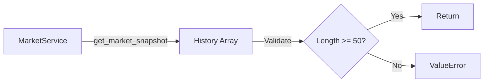

# Service Specification: Backtest Engine

**Type:** Vectorized Strategy Evaluator  
**Location:** `scripts/run_backtest.py`  
**Role:** Offline validation of trading strategies with Physics Veto enforcement

## 1. Architecture Overview

The `BacktestEngine` provides a **vectorized** backtesting framework that simulates trading strategies on historical price data while enforcing the **Physics Veto** (Alpha Threshold) to prevent trading during critical market regimes.

### Core Design Principles

1. **Physics First**: All strategy signals must pass the Alpha threshold check
2. **Vectorized Execution**: Efficient batch processing of price bars
3. **Strategy Agnostic**: Works with any strategy implementing `calculate_signal(df)`
4. **Metric Standardization**: All strategies evaluated with consistent metrics

## 2. Class Architecture

### `BacktestEngine`

```python
class BacktestEngine:
    def __init__(self, symbol: str = "SPY")
    def fetch_data(self) -> List[float]
    def run_strategy(self, strategy, history: List[float]) -> Dict
    def run_all_strategies(self)
    def print_results(self)
```

#### Initialization

- **Input**: `symbol` (str) - Asset to backtest (default: "SPY")
- **Services**:
  - `MarketService()` - Historical data provider
  - `PhysicsService()` - Regime analysis and Alpha calculation
- **State**: `results` (List[Dict]) - Accumulates strategy performance

## 3. Execution Flow

### Step 1: Data Acquisition (`fetch_data`)



**Requirements:**

- Minimum 50 bars required
- Data source: `MarketService.get_market_snapshot(symbol)`
- Returns: `List[float]` (close prices)

### Step 2: Strategy Simulation (`run_strategy`)

**For each time step `t` from `min_window` (20) to `len(history)`:**

#### 3.2.1 Signal Calculation

```python
window = df.iloc[: t + 1].copy()  # Expanding window
signal = strategy.calculate_signal(window)
```

- **Window Type**: Expanding (not rolling)
- **Minimum Window**: 20 bars
- **Fallback**: `signal = 0.0` if strategy raises exception

#### 3.2.2 Physics Veto (The Iron Gate)

```python
lookback = min(100, t)
regime_window = history[t - lookback : t + 1]
regime_analysis = physics_service.analyze_regime(regime_window)
alpha = regime_analysis.get("alpha", 3.0)

if alpha < 2.0:
    signal = 0.0  # VETO
```

**Veto Logic:**

- **Lookback**: Last 100 bars (or `t` if less)
- **Threshold**: $\alpha < 2.0$ (Critical Regime)
- **Action**: Force signal to 0.0 (no trade)
- **Fallback**: If `analyze_regime` fails, allow signal (fail-open)

#### 3.2.3 Return Calculation

```python
market_return = (history[t + 1] - history[t]) / history[t]
strategy_return = signal * market_return
```

**Assumptions:**

- **Execution Price**: Close of bar `t`
- **Exit Price**: Close of bar `t+1`
- **Slippage**: None (ideal execution)
- **Latency**: None (instantaneous)
- **Sizing**: Signal interpreted as fraction of capital (-1 to +1)

> [!WARNING]
> This is a **vectorized backtest** without latency or slippage simulation. Real-world results will differ. For production validation, use Event-Driven backtest with:
>
> - 100ms execution latency
> - Variable slippage (0.05% - 0.2% based on volatility)
> - 10% random partial fill rejection

### Step 3: Metric Calculation

#### Sharpe Ratio (Risk-Adjusted Return)

$$
\text{Sharpe} = \frac{\mu}{\sigma} \times \sqrt{252}
$$

Where:

- $\mu = \text{mean}(\text{pnl})$ (average daily return)
- $\sigma = \text{std}(\text{pnl})$ (volatility)
- $252$ = annualization factor (trading days/year)

**Implementation:**

```python
avg_return = np.mean(pnl)
std_return = np.std(pnl)
sharpe = (avg_return / std_return) * np.sqrt(252)
```

#### Total Return (Cumulative PnL)

$$
\text{Total Return} = \left( \prod_{i=1}^{N} (1 + r_i) \right) - 1
$$

**Implementation:**

```python
cumulative_return = np.prod([1 + r for r in pnl]) - 1
total_return_pct = cumulative_return * 100
```

#### Trade Count

```python
num_trades = sum(1 for s in signals if abs(s) > 0.01)
```

**Definition**: Number of non-zero signals (threshold: 0.01)

## 4. Output Schema

### `run_strategy` Returns

```python
{
    "name": str,              # Strategy name
    "sharpe": float,          # Annualized Sharpe Ratio
    "total_return": float,    # Cumulative return (%)
    "num_trades": int         # Count of non-zero signals
}
```

### `print_results` Output Format

```
============================================================
📊 BACKTEST RESULTS
============================================================
Strategy                       Sharpe     Return %     Trades    
------------------------------------------------------------
KalmanMomentumStrategy         1.23       45.67        89        
BollingerReversionStrategy     0.98       23.45        67        
============================================================

🏆 WINNER: KalmanMomentumStrategy (Sharpe: 1.23)
```

## 5. Registered Strategies

The engine evaluates all strategies in `STRATEGY_REGISTRY`:

1. **MoonPhaseStrategy** - Lunar cycle momentum
2. **KalmanMomentumStrategy** - Kinematic trend following
3. **BollingerReversionStrategy** - Mean reversion on bands
4. **FractalBreakoutStrategy** - Support/resistance breakouts
5. **QuantumOscillatorStrategy** - Harmonic oscillator signals

**Contract**: Each strategy must implement:

```python
class Strategy:
    name: str
    def calculate_signal(self, df: pd.DataFrame) -> float
```

## 6. Usage

### Command Line

```bash
python scripts/run_backtest.py
```

### Programmatic

```python
from scripts.run_backtest import BacktestEngine

engine = BacktestEngine(symbol="AAPL")
engine.run_all_strategies()

# Access results
for result in engine.results:
    print(f"{result['name']}: Sharpe={result['sharpe']:.2f}")
```

## 7. Limitations & Future Enhancements

### Current Limitations

- ❌ No slippage modeling
- ❌ No execution latency (100ms target)
- ❌ No partial fills
- ❌ No commission/fees
- ❌ Fixed position sizing (signal = allocation)

### Planned Enhancements

- [ ] Event-driven simulation mode
- [ ] Dynamic slippage (volatility-based)
- [ ] Fractional Kelly position sizing
- [ ] Multi-asset portfolio backtest
- [ ] Walk-forward optimization
- [ ] Monte Carlo validation

## 8. Validation Standards

> [!IMPORTANT]
> **Physics Veto Enforcement**: Any strategy showing Sharpe > 1.5 WITHOUT Physics Veto must be re-validated. The Veto is non-negotiable and represents our "No Cheating" rule for regime-aware trading.

**Acceptance Criteria for Production:**

1. Sharpe Ratio >= 1.0 (with Physics Veto)
2. Total Return > 15% annualized
3. Trade Count >= 20 (sufficient sample size)
4. Passes Event-Driven backtest (when available)

## 9. Integration Points

- **Input**: `MarketService.get_market_snapshot(symbol)` → price history
- **Physics**: `PhysicsService.analyze_regime(prices)` → Alpha coefficient
- **Strategies**: `STRATEGY_REGISTRY` → list of strategy instances
- **Output**: Console table + `engine.results` (programmatic access)
