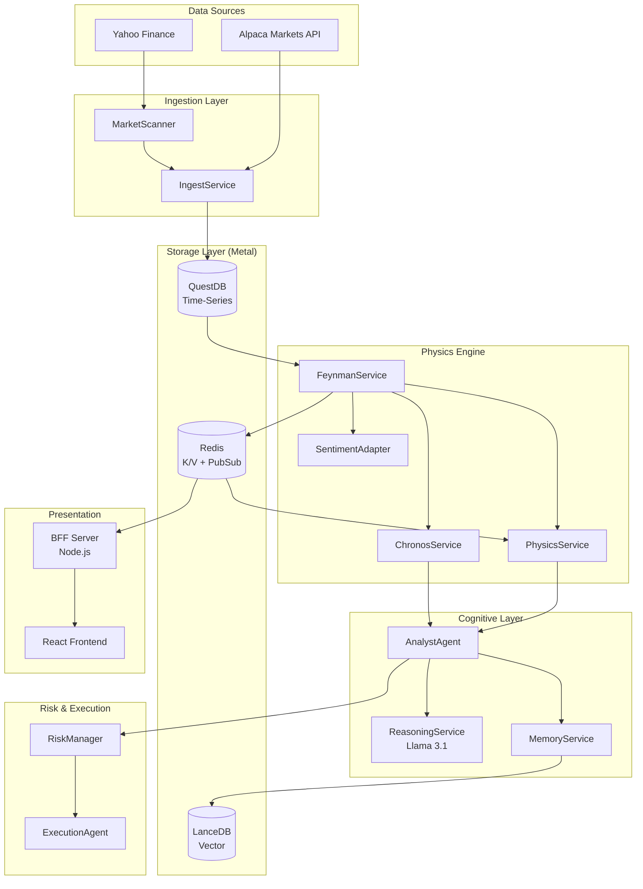
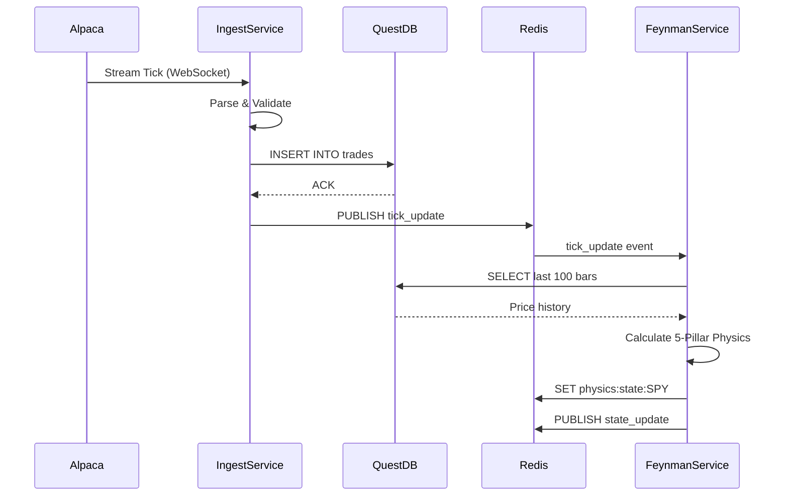
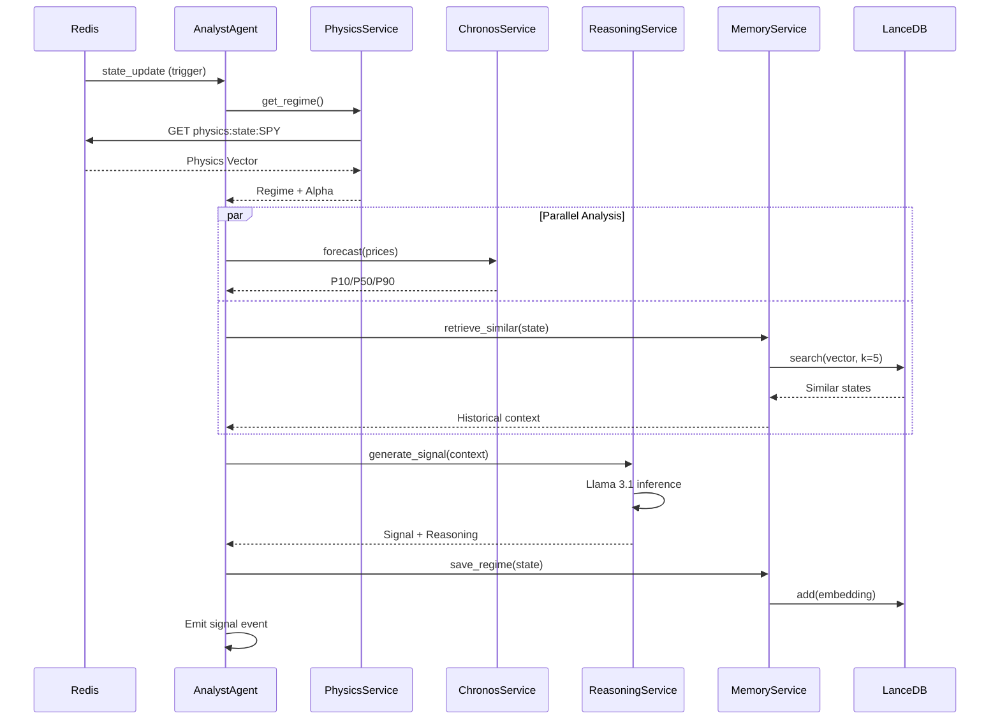
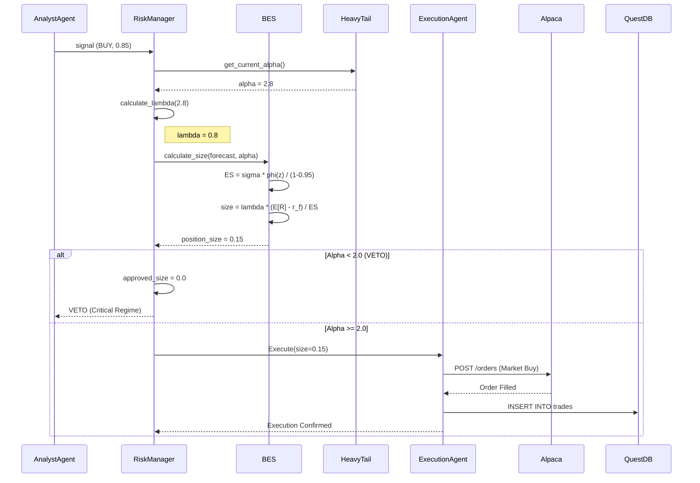
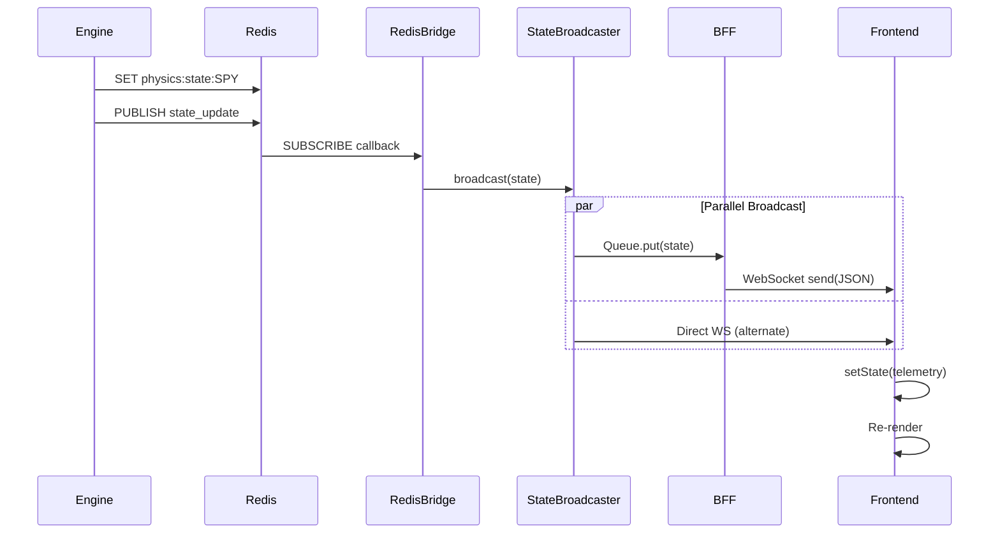

# Architecture Specification: Data Flow & State Management

**Version:** V2 (Updated with LanceDB, QuestDB)  
**Last Updated:** 2025-12-21

## 1. System Architecture Overview



## 2. Tick Ingestion Flow

### 2.1 Sequence Diagram



**Latency Breakdown:**

- WebSocket Receive: ~50ms
- QuestDB Write: ~5ms
- Redis Publish: ~1ms
- **Total**: ~60ms (tick → physics)

### 2.2 Data Transformations

**Alpaca Tick:**

```json
{
    "S": "SPY",
    "p": 450.32,
    "s": 100,
    "t": "2025-12-21T12:00:00.123456Z",
    "x": "NASDAQ"
}
```

**QuestDB Record:**

```sql
INSERT INTO trades (
    symbol, price, size, timestamp, exchange
) VALUES (
    'SPY', 450.32, 100, '2025-12-21T12:00:00.123456Z', 'NASDAQ'
);
```

**Redis State:**

```json
{
    "mass": 0.42,
    "momentum": 1.23,
    "friction": 0.15,
    "entropy": 0.08,
    "nash_dist": 0.05,
    "alpha": 2.8,
    "regime": "Gaussian"
}
```

## 3. Signal Generation Flow

### 3.1 Sequence Diagram



**Latency Breakdown:**

- Physics Retrieval: ~1ms (Redis)
- Chronos Forecast: ~120ms (MPS)
- Vector Search: ~130ms (LanceDB)
- LLM Reasoning: ~2000ms (Llama 3.1)
- **Total**: ~2.3s (signal generation)

### 3.2 Vector Embedding

**Market State Embedding** (384-dimensional):

```python
# Construct state dict
state = {
    "physics": {
        "mass": 0.42,
        "momentum": 1.23,
        ...
    },
    "sentiment": {
        "label": "Bullish",
        "score": 0.85
    }
}

# Embed using sentence-transformers
from sentence_transformers import SentenceTransformer
model = SentenceTransformer('all-MiniLM-L6-v2')
vector = model.encode(json.dumps(state))  # 384-dim

# Store in LanceDB
memory_service.save_regime(
    symbol="SPY",
    state=state,
    vector=vector
)
```

## 4. Trade Execution Flow

### 4.1 Sequence Diagram



**Latency Breakdown:**

- Alpha Calculation: ~0.1ms
- BES Sizing: ~0.2ms
- Alpaca Order: ~50-200ms
- QuestDB Write: ~5ms
- **Total**: ~60-210ms (decision → execution)

### 4.2 Position Sizing Calculation

**Input:**

- Alpha: 2.8 (Lévy Stable regime)
- Expected Return: 5% (from Chronos P50)
- ES: 16.12% (from forecast spread)
- Risk-Free Rate: 0.04 (4% annual)

**Calculation:**

```python
# 1. Lambda
lambda_val = alpha - 2.0 = 0.8

# 2. Risk-Free Adjustment
r_f_scaled = 0.04 * (10 / 252) = 0.00159

# 3. Excess Return
excess_return = 0.05 - 0.00159 = 0.04841

# 4. Raw Size
raw_size = 0.8 * (0.04841 / 0.1612) = 0.2402

# 5. Cap
final_size = min(0.2402, 0.20) = 0.20  # 20% max
```

## 5. WebSocket Real-Time Updates

### 5.1 Sequence Diagram



**Update Frequency:**

- Engine → Redis: ~1 Hz (every tick)
- Redis → Frontend: ~1 Hz (real-time)
- BFF Polling: 1 Hz (fallback)

## 6. Database Persistence Strategy

### 6.1 QuestDB (Time-Series)

**Tables:**

**`trades`:**

```sql
CREATE TABLE trades (
    symbol SYMBOL,
    price DOUBLE,
    size INTEGER,
    timestamp TIMESTAMP,
    exchange SYMBOL,
    side SYMBOL
) timestamp(timestamp) PARTITION BY DAY;
```

**`ohlcv_1d`:**

```sql
CREATE TABLE ohlcv_1d (
    symbol SYMBOL,
    open DOUBLE,
    high DOUBLE,
    low DOUBLE,
    close DOUBLE,
    volume LONG,
    date DATE
) timestamp(date) PARTITION BY MONTH;
```

**Access Patterns:**

- **Write**: High-frequency appends (~100 ticks/sec)
- **Read**: Historical queries (last 100 bars, last 252 days)

**Performance:**

- Insert: ~5ms (batched)
- Query: ~20ms (indexed on symbol+timestamp)

### 6.2 LanceDB (Vector Search)

**Table:** `market_state_embeddings`

**Schema:**

```python
class MarketStateEmbedding(LanceModel):
    vector: Vector(384)
    symbol: str
    timestamp: datetime
    metadata: str  # JSON: {"physics": {...}, "sentiment": {...}}
```

**Access Patterns:**

- **Write**: Every signal generation (~1/min)
- **Read**: Similarity search (k=5 nearest neighbors)

**Performance:**

- Insert: ~10ms
- Search: ~130ms (ANN index)

### 6.3 Redis (State + Pub/Sub)

**Keys:**

- `physics:state:{symbol}` - Current physics vector
- `market:snapshot:{symbol}` - Cached market data (future)

**Channels:**

- `state_update` - Real-time broadcasts

**Performance:**

- GET: <1ms
- SET: <1ms
- PUBLISH: <1ms

**Persistence:**

- RDB: Snapshot every 60s if 100+ writes
- AOF: Append-only log (everysec)

## 7. Data Retention & Archival

### 7.1 Hot vs Cold Storage

**Hot (QuestDB):**

- Last 30 days of trades
- Last 2 years of daily OHLCV
- Access: Real-time + backtesting

**Cold (Future: S3/Parquet):**

- Historical data > 2 years
- Access: Rare (regulatory, research)

**Archival Policy:**

```sql
-- Monthly job (example)
COPY (
    SELECT * FROM trades 
    WHERE timestamp < dateadd('d', -30, now())
) TO 's3://bucket/trades/2024-11-*.parquet';

DELETE FROM trades 
WHERE timestamp < dateadd('d', -30, now());
```

### 7.2 LanceDB Pruning

**Strategy:** Keep only representative states

```python
# Monthly: Cluster embeddings, keep centroids
from sklearn.cluster import KMeans

embeddings = table.to_pandas()['vector'].tolist()
kmeans = KMeans(n_clusters=1000, random_state=42)
kmeans.fit(embeddings)

# Keep only centroids (1000 states)
representative_ids = [...]  # Find nearest to centroids
table.delete("id NOT IN (?)", representative_ids)
```

**Result:** 100k states → 1k (100x reduction)

## 8. Monitoring & Telemetry

### 8.1 Key Metrics

**Ingestion:**

- `cc.ingest.ticks_per_sec` - Throughput
- `cc.ingest.latency_ms` - Tick → QuestDB latency

**Physics:**

- `cc.physics.alpha` - Current tail index
- `cc.physics.velocity` - Kalman velocity
- `cc.physics.calculation_time_ms` - Latency

**Signal:**

- `cc.signal.generation_time_ms` - Total latency
- `cc.signal.confidence` - Signal strength

**Execution:**

- `cc.execution.order_latency_ms` - Decision → fill
- `cc.execution.fills_per_day` - Trade count

### 8.2 Alerting

**Critical:**

- 🚨 `alpha < 2.0` (Critical regime)
- 🚨 WebSocket disconnected > 10s
- 🚨 QuestDB write failure

**Warning:**

- ⚠️ Forecast latency > 500ms
- ⚠️ Redis memory > 80%
- ⚠️ Signal confidence < 0.5

## 9. Disaster Recovery

### 9.1 Backup Strategy

**QuestDB:**

```bash
# Daily snapshot
questdb backup --output=/backup/questdb-$(date +%Y%m%d).tar.gz

# S3 upload
aws s3 cp /backup/questdb-$(date +%Y%m%d).tar.gz s3://bucket/backups/
```

**LanceDB:**

```bash
# Copy data directory
tar -czf /backup/lancedb-$(date +%Y%m%d).tar.gz data/lancedb/

# S3 upload
aws s3 cp /backup/lancedb-$(date +%Y%m%d).tar.gz s3://bucket/backups/
```

**Redis:**

```bash
# Triggered save
redis-cli BGSAVE

# Copy RDB + AOF
cp /data/dump.rdb /backup/redis-$(date +%Y%m%d).rdb
```

### 9.2 Recovery Procedures

**Scenario: Complete data loss**

1. **Restore QuestDB:**

```bash
wget s3://bucket/backups/questdb-latest.tar.gz
tar -xzf questdb-latest.tar.gz -C /data/questdb/
```

2. **Backfill Missing Data:**

```bash
python scripts/backfill_tier1.py --start=2024-12-01 --end=2024-12-21
```

3. **Restore LanceDB:**

```bash
wget s3://bucket/backups/lancedb-latest.tar.gz
tar -xzf lancedb-latest.tar.gz -C data/
```

4. **Rebuild Redis State:**

```bash
# Re-run physics on latest data
python scripts/rebuild_physics_cache.py
```

**RTO:** 2 hours (Recovery Time Objective)  
**RPO:** 1 day (Recovery Point Objective)

## 10. Future Enhancements

- [ ] **ClickHouse** for ultra-fast analytics (replace QuestDB)
- [ ] **Kafka** for event streaming (replace Redis Pub/Sub)
- [ ] **MinIO** for S3-compatible object storage (on-prem)
- [ ] **Prometheus** for time-series metrics (replace custom)
- [ ] **Multi-region replication** (disaster recovery)
