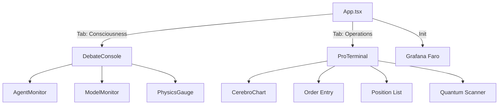

# Frontend Specification: Component Library

**Framework:** React 18 + TypeScript + Vite  
**UI Library:** TailwindCSS + Custom Glassmorphism  
**Chart Library:** Lightweight Charts (TradingView)  
**Icons:** Lucide React

## 1. Architecture Overview

The frontend is a **Single Page Application (SPA)** with:

- **2 main views**: Debate Console (Consciousness) + Pro Terminal (Operations)
- **13 React components** (12 functional + 1 root)
- **WebSocket-driven** real-time updates
- **Grafana Faro** RUM observability



## 2. Core Components

### 2.1 [`App.tsx`](file:///Users/zishanmalik/curiosity_cottage_quant/frontend/src/App.tsx)

**Purpose:** Root component with tabbed navigation

**State:**

- `isReady` (boolean) - Telemetry initialization status
- `activeTab` (string) - Current view: `'debate'` | `'terminal'`

**Lifecycle:**

```tsx
useEffect(() => {
    initTelemetry();  // Grafana Faro
    setIsReady(true);
}, []);
```

**UI Structure:**

```
┌─ Navigation Bar ─────────────────┐
│ [CONSCIOUSNESS] [OPERATIONS]     │
│ ENGINE: ONLINE | WS: ACTIVE      │
└──────────────────────────────────┘
┌─ Active View ────────────────────┐
│ <DebateConsole /> OR             │
│ <ProTerminal />                  │
└──────────────────────────────────┘
```

**Loading State:**

- Spinner + "INITIALIZING TELEMETRY..." message
- Blocks render until `isReady === true`

### 2.2 [`ProTerminal.tsx`](file:///Users/zishanmalik/curiosity_cottage_quant/frontend/src/components/ProTerminal.tsx)

**Purpose:** Main trading interface (Operations view)

**Key Features:**

1. **Live Price Chart** (TradingView Candlestick)
2. **Physics Gauges** (Alpha, Velocity)
3. **Order Entry** (Buy/Sell with limit/market)
4. **Quantum Scanner** (Top candidates)
5. **Positions** (Real-time P&L)
6. **System Logs** (Streaming terminal)

**State Management:**

```tsx
const [isConnected, setIsConnected] = useState<boolean>(false);
const [telemetry, setTelemetry] = useState<TelemetryPacket | null>(null);
const [positions, setPositions] = useState<Position[]>([]);
const [logs, setLogs] = useState<string[]>([]);
```

**WebSocket Integration:**

```tsx
useEffect(() => {
    const ws = new WebSocket('ws://localhost:8000/api/ws/stream');
    
    ws.onmessage = (event) => {
        const packet: TelemetryPacket = JSON.parse(event.data);
        setTelemetry(packet);
        
        // Update chart
        if (packet.market?.history && candleSeriesRef.current) {
            candleSeriesRef.current.update(latestBar);
        }
    };
    
    ws.onclose = () => {
        setTimeout(connect, 3000);  // Retry
    };
}, []);
```

**REST API Calls:**

- `GET /api/market/history/:symbol` - Initial chart hydration
- `GET /api/orders/positions` - Fetch positions
- `POST /api/orders/submit` - Place order
- `POST /api/actions/halt` - Emergency stop

**Grid Layout:**

```
┌─────────────────────────────────────────┐
│ Price | Chart (6 cols) | Execution      │
│ Alpha |                | Positions       │
│       |                | Scanner         │
└─────────────────────────────────────────┘
│ System Logs (full width)                │
└─────────────────────────────────────────┘
```

### 2.3 [`DebateConsole.jsx`](file:///Users/zishanmalik/curiosity_cottage_quant/frontend/src/components/DebateConsole.jsx)

**Purpose:** Agent "consciousness" visualization

**Features:**

- Real-time LLM reasoning streams
- Multi-agent debate display
- Confidence meters
- Strategy selection votes

**Event Flow:**

```
WebSocket → Debate Packet → Filter LLM messages → Render stream
```

### 2.4 [`CerebroChart.tsx`](file:///Users/zishanmalik/curiosity_cottage_quant/frontend/src/components/CerebroChart.tsx)

**Purpose:** Price chart with signal overlays

**Library:** `lightweight-charts` (TradingView)

**Configuration:**

```tsx
const chart = createChart(container, {
    layout: {
        background: { type: ColorType.Solid, color: 'transparent' },
        textColor: '#94a3b8'
    },
    grid: {
        vertLines: { color: 'rgba(255,255,255,0.05)' },
        horzLines: { color: 'rgba(255,255,255,0.05)' }
    }
});

const candlestickSeries = chart.addCandlestickSeries({
    upColor: '#26a69a',    // TradingView Green
    downColor: '#ef5350',  // TradingView Red
});
```

**Data Format:**

```tsx
interface CandlestickData {
    time: string;  // ISO8601 or YYYY-MM-DD
    open: number;
    high: number;
    low: number;
    close: number;
}
```

**Update Strategy:**

- **Initial**: `setData(historicalBars)` - Full history from REST
- **Streaming**: `update(latestBar)` - Real-time WebSocket updates

### 2.5 [`AgentMonitor.tsx`](file:///Users/zishanmalik/curiosity_cottage_quant/frontend/src/components/AgentMonitor.tsx)

**Purpose:** Display agent performance metrics

**Metrics:**

```tsx
interface AgentMetrics {
    latency_ms: number;
    success_rate: number;  // 0.0 to 1.0
    invocations: number;
}
```

**Visual:**

- Agent name + status badge
- Latency bar chart
- Success rate percentage
- Invocation count

### 2.6 [`ModelMonitor.tsx`](file:///Users/zishanmalik/curiosity_cottage_quant/frontend/src/components/ModelMonitor.tsx)

**Purpose:** Neural model performance tracking

**Metrics:**

```tsx
interface ModelMetrics {
    latency_ms: number;
    invocations: number;
    cache_hit_rate?: number;  // Optional
}
```

**Tracked Models:**

- `ChronosService` (Forecast)
- `SentimentAdapter` (FinBERT ONNX)
- `ReasoningService` (Ollama Llama)

### 2.7 [`PhysicsGauge.tsx`](file:///Users/zishanmalik/curiosity_cottage_quant/frontend/src/components/PhysicsGauge.tsx)

**Purpose:** Visualize 5-Pillar Physics Vector

**Inputs:**

- `mass`, `momentum`, `friction`, `entropy`, `nash_dist`
- `alpha` (Hill Estimator)
- `regime` (Gaussian/Lévy/Critical)

**Visual:** Radial gauge with color-coded regimes

### 2.8 [`SentimentTriad.tsx`](file:///Users/zishanmalik/curiosity_cottage_quant/frontend/src/components/SentimentTriad.tsx)

**Purpose:** Display FinBERT sentiment scores

**Inputs:**

```tsx
{
    label: "Bullish" | "Neutral" | "Bearish",
    score: number  // 0.0 to 1.0
}
```

**Visual:** 3-way pie chart or bar chart

## 3. State Management

### 3.1 WebSocket Context Pattern

**No global state library** (Redux/MobX). Instead:

1. **Local component state** (`useState`)
2. **WebSocket subscription** in `useEffect`
3. **Props drilling** for shared data

**Example:**

```tsx
// In ProTerminal
const [telemetry, setTelemetry] = useState<TelemetryPacket | null>(null);

useEffect(() => {
    ws.onmessage = (event) => {
        setTelemetry(JSON.parse(event.data));
    };
}, []);

// Pass to child
<PhysicsGauge alpha={telemetry?.market?.alpha} />
```

### 3.2 Telemetry Packet Structure

**Source:** BFF Server `ws://localhost:3000`

**Schema:**

```tsx
interface TelemetryPacket {
    timestamp: string;
    status: string;
    market: {
        symbol: string;
        price: number;
        alpha: number;
        velocity: number;
        acceleration: number;
        history?: CandlestickData[];
    };
    portfolio: {
        nav: number;
        cash: number;
        daily_pnl: number;
        max_drawdown: number;
    };
    signal: {
        side: "BUY" | "SELL" | "FLAT";
        confidence: number;
        reasoning: string;
    };
    governance: {
        approved_size: number;
    };
    logs: LogEntry[];
    agents: Record<string, AgentMetrics>;
    models: Record<string, ModelMetrics>;
}
```

## 4. Design System

### 4.1 Color Palette

Defined in [`index.css`](file:///Users/zishanmalik/curiosity_cottage_quant/frontend/src/index.css):

```css
:root {
    --background: 222.2 84% 4.9%;     /* Dark Slate */
    --foreground: 210 40% 98%;         /* Light Gray */
    --primary: 199 89% 48%;            /* Neon Blue */
    --secondary: 326 100% 74%;         /* Neon Pink */
    --success: 142 71% 45%;            /* Green */
    --danger: 0 84% 60%;               /* Red */
}
```

**Brand Colors:**

- Primary: `#22D3EE` (Cyan)
- Accent: `#EC4899` (Pink)
- Success: `#10B981` (Green)
- Danger: `#EF4444` (Red)

### 4.2 Typography

**Font Family:** `font-mono` (system monospace)

**Geist** (mentioned in docs) not actually used—using system default.

**Sizes:**

- Headers: `text-xl` (1.25rem)
- Body: `text-sm` (0.875rem)
- Micro: `text-xs` (0.75rem)

### 4.3 Glassmorphism Effects

**Custom Tailwind Class:**

```css
.glass-panel {
    @apply bg-[#0D1117]/60      /* Semi-transparent dark */
           backdrop-blur-md       /* Blur background */
           border border-white/5  /* Subtle border */
           shadow-xl;             /* Depth */
}

.glass-input {
    @apply bg-black/20 
           border border-white/10 
           focus:border-[#88C0D0]/50 
           focus:ring-1 focus:ring-[#88C0D0]/20;
}
```

**Neon Effects:**

```css
.neon-text-blue {
    text-shadow: 0 0 10px rgba(136, 192, 208, 0.5);
}

.neon-border {
    box-shadow: 0 0 10px rgba(136, 192, 208, 0.2);
}
```

### 4.4 Animations

**Loading Spinner:**

```tsx
<Loader2 className="w-8 h-8 animate-spin text-emerald-500" />
```

**Pulse (Status Indicator):**

```tsx
<div className="w-1.5 h-1.5 rounded-full bg-emerald-500 animate-pulse" />
```

**Custom Scrollbar:**

```css
::-webkit-scrollbar {
    width: 6px;
    background: transparent;
}
::-webkit-scrollbar-thumb {
    background: rgba(255, 255, 255, 0.1);
    border-radius: 3px;
}
```

## 5. Performance Optimizations

### 5.1 Chart Rendering

**Library Choice:** `lightweight-charts` (WebGL-accelerated)

**Update Strategy:**

- Initial load: `setData()` (full history)
- Streaming: `update()` (incremental, ~60 FPS capable)

**Resize Observer:**

```tsx
const resizeObserver = new ResizeObserver(entries => {
    chart.applyOptions({ 
        width: newRect.width, 
        height: newRect.height 
    });
});
```

### 5.2 WebSocket Reconnection

**Exponential Backoff:**

```tsx
ws.onclose = () => {
    setIsConnected(false);
    setTimeout(connect, 3000);  // 3s fixed delay
};
```

**Future Enhancement:** True exponential (1s, 2s, 4s, 8s, max 30s)

### 5.3 Log Auto-Scroll

```tsx
const logsEndRef = useRef<HTMLDivElement>(null);

useEffect(() => {
    logsEndRef.current?.scrollIntoView({ behavior: "smooth" });
}, [logs]);
```

**Performance:** Smooth scroll on log append, no full re-render

## 6. Observability Integration

### 6.1 Grafana Faro RUM

**Initialization:** [`telemetry.ts`](file:///Users/zishanmalik/curiosity_cottage_quant/frontend/src/telemetry.ts)

```tsx
initializeFaro({
    url: 'https://faro-collector-prod-us-west-0.grafana.net/collect/...',
    app: {
        name: 'Curiosity Cottage Quant',
        version: '1.0.0',
        environment: 'development'
    },
    instrumentations: [
        ...getWebInstrumentations({ captureConsole: true }),
        new TracingInstrumentation(),
        new ReactIntegration({ router: { version: ReactRouterVersion.V6 } })
    ]
});
```

**Captured Metrics:**

- Console logs (info, warn, error)
- Unhandled errors & exceptions
- Web Vitals (LCP, FID, CLS)
- Network timing (fetch, XHR)
- React component errors
- Route changes (if using React Router)

## 7. Build & Deployment

### 7.1 Development

```bash
cd frontend
npm install
npm run dev  # Starts Vite dev server on :5173
```

**Hot Module Replacement (HMR):** Instant updates, no refresh

### 7.2 Production Build

```bash
npm run build  # Outputs to dist/
```

**Output:**

- `dist/index.html` - Entry point
- `dist/assets/*.js` - Bundled/minified JS
- `dist/assets/*.css` - Bundled/minified CSS

**Optimization:**

- Code splitting (vendor chunks)
- Minification (Terser)
- Tree shaking (dead code elimination)

### 7.3 Docker

**Served via:** Nginx (static files)

```dockerfile
FROM nginx:alpine
COPY dist/ /usr/share/nginx/html
EXPOSE 80
```

## 8. Accessibility

### 8.1 Keyboard Navigation

**Tab Order:**

- Navigation buttons
- Order entry inputs
- Submit button

**Enter Key:** Submit order

### 8.2 ARIA Labels

**Currently:** Minimal ARIA (not implemented)

**Future:**

- `aria-label` on icon-only buttons
- `role="status"` on live regions (logs, price)
- `aria-live="polite"` for telemetry updates

## 9. Browser Compatibility

**Supported:**

- Chrome 90+
- Edge 90+
- Firefox 88+
- Safari 14+

**Not Supported:**

- IE11 (no WebSocket support)

**Polyfills:** None required (ES2020+ target)

## 10. Future Enhancements

- [ ] **Dark/Light Mode** toggle
- [ ] **Multi-Symbol** view (tabs for SPY, QQQ, etc.)
- [ ] **Historical Playback** (scrub chart timeline)
- [ ] **Alert System** (browser notifications)
- [ ] **Mobile Layout** (responsive grid)
- [ ] **Export Data** (CSV download)
- [ ] **Customizable Layouts** (drag-drop panels)
