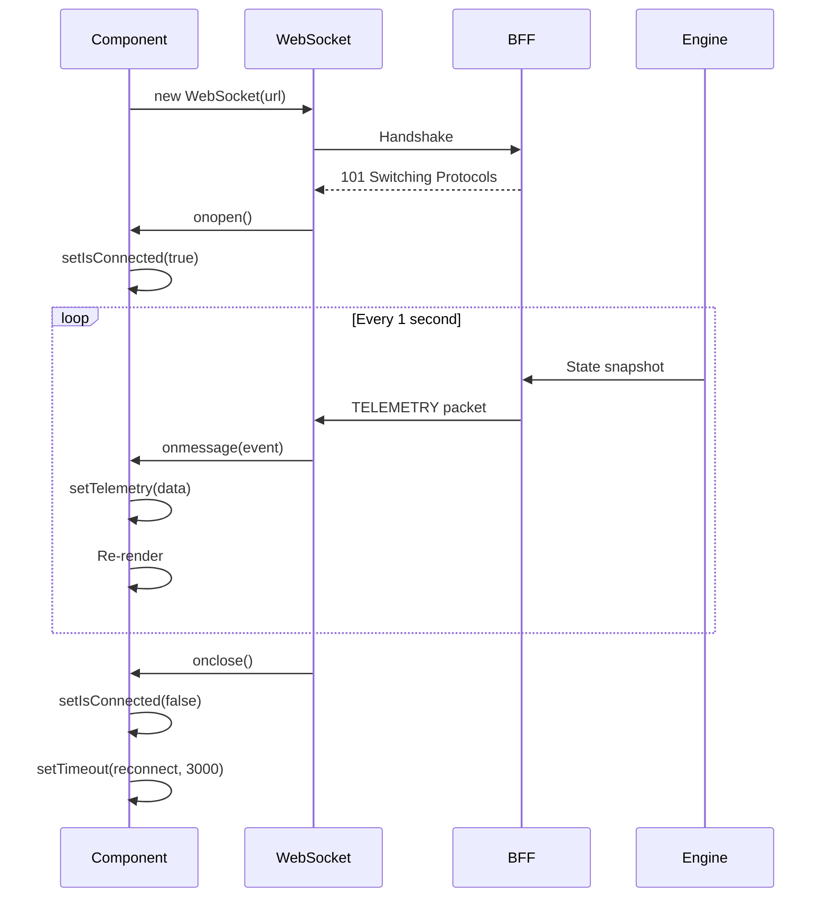

# Frontend Specification: State Management & WebSocket Flow

**Pattern:** WebSocket-Driven Component State (No Redux/MobX)  
**Update Frequency:** ~1 Hz (1 message/second from BFF)

## 1. Architecture Philosophy

### 1.1 No Global State Library

**Decision:** Use **local component state** + **WebSocket subscriptions** instead of Redux/MobX.

**Rationale:**

- **Simplicity**: No boilerplate (actions, reducers, selectors)
- **Performance**: Direct state updates, no middleware
- **Real-time**: WebSocket is the source of truth

**Trade-off:**

- ❌ Props drilling for shared state
- ✅ Clear data flow (WebSocket → setState → render)

## 2. WebSocket Connection Flow

### 2.1 Connection Lifecycle



### 2.2 Implementation

**File:** [`ProTerminal.tsx`](file:///Users/zishanmalik/curiosity_cottage_quant/frontend/src/components/ProTerminal.tsx)

```tsx
useEffect(() => {
    const WS_URL = 'ws://localhost:8000/api/ws/stream';
    let ws: WebSocket;

    const connect = () => {
        ws = new WebSocket(WS_URL);
        
        ws.onopen = () => {
            setIsConnected(true);
            addLog("System Connected to Nucleus.");
        };
        
        ws.onmessage = (event) => {
            const packet: TelemetryPacket = JSON.parse(event.data);
            setTelemetry(packet);
            
            // Update chart (side effect)
            if (packet.market?.history && candleSeriesRef.current) {
                candleSeriesRef.current.update(latestBar);
            }
            
            // Log reasoning
            if (packet.signal?.reasoning) {
                addLog(`[ANALYST] ${packet.signal.reasoning}`);
            }
        };
        
        ws.onclose = () => {
            setIsConnected(false);
            addLog("Connection Lost. Retrying...");
            setTimeout(connect, 3000);  // Retry
        };
        
        ws.onerror = (error) => {
            console.error("WebSocket error:", error);
        };
    };

    connect();
    
    // Cleanup
    return () => ws?.close();
}, []);
```

**Key Patterns:**

- ✅ **Auto-reconnect** on close (3s delay)
- ✅ **Cleanup** in `useEffect` return
- ✅ **Error logging** to console
- ❌ **No exponential backoff** (fixed 3s)

## 3. State Structure

### 3.1 Component State

**ProTerminal State:**

```tsx
const [isConnected, setIsConnected] = useState<boolean>(false);
const [telemetry, setTelemetry] = useState<TelemetryPacket | null>(null);
const [positions, setPositions] = useState<Position[]>([]);
const [logs, setLogs] = useState<string[]>([]);
const [orderSide, setOrderSide] = useState<'buy' | 'sell'>('buy');
const [orderQty, setOrderQty] = useState<string>('');
```

**DebateConsole State:**

```tsx
const [debates, setDebates] = useState<DebateMessage[]>([]);
const [agentMetrics, setAgentMetrics] = useState<AgentMetrics>({});
const [modelMetrics, setModelMetrics] = useState<ModelMetrics>({});
```

### 3.2 Derived State

**Pattern:** Compute on render, not store in state

```tsx
// ❌ Bad: Storing derived value
const [price, setPrice] = useState(0);
useEffect(() => {
    setPrice(telemetry?.market?.price || 0);
}, [telemetry]);

// ✅ Good: Compute directly
const price = telemetry?.market?.price || 0.00;
```

**Benefits:**

- No stale data
- Fewer re-renders
- Single source of truth

## 4. Telemetry Packet Processing

### 4.1 Packet Schema

```tsx
interface TelemetryPacket {
    timestamp: string;
    status: string;
    market: {
        symbol: string;
        price: number;
        alpha: number;
        velocity: number;
        acceleration: number;
        history?: CandlestickData[];
    };
    portfolio: {
        nav: number;
        cash: number;
        daily_pnl: number;
        max_drawdown: number;
    };
    signal: {
        side: "BUY" | "SELL" | "FLAT";
        confidence: number;
        reasoning: string;
    };
    governance: {
        approved_size: number;
    };
    logs: LogEntry[];
    agents: Record<string, AgentMetrics>;
    models: Record<string, ModelMetrics>;
}
```

### 4.2 Update Handlers

**Market Data:**

```tsx
if (packet.market) {
    // Update chart
    if (packet.market.history && candleSeriesRef.current) {
        const latest = packet.market.history[packet.market.history.length - 1];
        candleSeriesRef.current.update({
            time: latest.timestamp.split('T')[0],
            open: latest.open,
            high: latest.high,
            low: latest.low,
            close: latest.close
        });
    }
}
```

**Logs:**

```tsx
if (packet.signal?.reasoning) {
    addLog(`[ANALYST] ${packet.signal.reasoning}`);
}

const addLog = (msg: string) => {
    setLogs(prev => [...prev.slice(-19), `[${new Date().toLocaleTimeString()}] ${msg}`]);
};
```

**Key Pattern:** Keep only last 20 logs (memory management)

## 5. Chart State Management

### 5.1 Refs for Imperative Updates

**Problem:** Chart API is imperative, React is declarative

**Solution:** Use `useRef` to hold chart instances

```tsx
const chartRef = useRef<IChartApi | null>(null);
const candleSeriesRef = useRef<ISeriesApi<"Candlestick"> | null>(null);

// Initialize once
useEffect(() => {
    if (!chartRef.current && chartContainerRef.current) {
        const chart = createChart(chartContainerRef.current, options);
        const series = chart.addCandlestickSeries();
        
        chartRef.current = chart;
        candleSeriesRef.current = series;
    }
}, []);

// Update imperatively
candleSeriesRef.current.update(newBar);
```

**Why Refs?**

- ✅ Survives re-renders
- ✅ No re-initialization
- ✅ Direct imperative access

### 5.2 Initial Load vs Streaming

**Initial Load** (REST API):

```tsx
useEffect(() => {
    const loadInitialData = async () => {
        const histRes = await fetch('http://localhost:8000/api/market/history/SPY?limit=100');
        const histData = await histRes.json();
        
        if (candleSeriesRef.current) {
            candleSeriesRef.current.setData(histData);  // Full replace
        }
    };
    
    loadInitialData();
}, []);
```

**Streaming Update** (WebSocket):

```tsx
ws.onmessage = (event) => {
    const packet = JSON.parse(event.data);
    
    if (packet.market?.history) {
        const latest = packet.market.history[packet.market.history.length - 1];
        candleSeriesRef.current.update(latest);  // Incremental
    }
};
```

**Key Difference:**

- `setData()` → Full replacement (initial load)
- `update()` → Append/update latest bar (streaming)

## 6. Side Effects

### 6.1 Auto-Scroll Logs

**Pattern:** Scroll on log change

```tsx
const logsEndRef = useRef<HTMLDivElement>(null);

useEffect(() => {
    logsEndRef.current?.scrollIntoView({ behavior: "smooth" });
}, [logs]);

// In JSX
<div className="logs-container">
    {logs.map(log => <div>{log}</div>)}
    <div ref={logsEndRef} />
</div>
```

### 6.2 Fetch Positions on Order

**Pattern:** Re-fetch after mutation

```tsx
const handleOrder = async () => {
    const res = await fetch('/api/orders/submit', { 
        method: 'POST', 
        body: JSON.stringify(order) 
    });
    
    if (res.ok) {
        fetchPositions();  // Re-fetch
    }
};

const fetchPositions = async () => {
    const res = await fetch('/api/orders/positions');
    const data = await res.json();
    setPositions(data);
};
```

**Alternative:** Optimistic update (add position immediately, rollback on error)

## 7. Error Handling

### 7.1 WebSocket Errors

**onclose vs onerror:**

```tsx
ws.onerror = (error) => {
    console.error("WebSocket error:", error);
    // Logged but not acted upon (onclose handles reconnect)
};

ws.onclose = (event) => {
    setIsConnected(false);
    addLog("Connection Lost. Retrying...");
    
    if (event.code === 1006) {
        // Abnormal closure (network issue)
        setTimeout(connect, 5000);  // Longer delay
    } else {
        setTimeout(connect, 3000);
    }
};
```

### 7.2 REST API Errors

**Pattern:** Try-catch + user notification

```tsx
const handleOrder = async () => {
    try {
        const res = await fetch(url, options);
        const data = await res.json();
        
        if (!res.ok) {
            throw new Error(data.message || 'Order failed');
        }
        
        addLog(`✅ Order confirmed: ${data.message}`);
    } catch (error: any) {
        addLog(`❌ Error: ${error.message}`);
    }
};
```

## 8. Performance Considerations

### 8.1 Prevent Unnecessary Re-renders

**Problem:** Telemetry updates every second → component re-renders

**Solutions:**

**1. Memoize child components:**

```tsx
const PhysicsGauge = React.memo(({ alpha, velocity }) => {
    // Only re-renders if alpha or velocity change
});
```

**2. Extract derived state:**

```tsx
// ❌ Bad: Inline object creation (new reference every render)
<PhysicsGauge data={{ alpha, velocity }} />

// ✅ Good: Primitives (stable references)
<PhysicsGauge alpha={alpha} velocity={velocity} />
```

### 8.2 Debounce User Input

**Pattern:** Debounce order quantity input

```tsx
import { useDebouncedCallback } from 'use-debounce';

const handleQtyChange = useDebouncedCallback((value: string) => {
    setOrderQty(value);
}, 300);

<input onChange={(e) => handleQtyChange(e.target.value)} />
```

## 9. Testing Strategy

### 9.1 WebSocket Mocking

**Library:** `mock-socket`

```tsx
import { Server } from 'mock-socket';

const mockServer = new Server('ws://localhost:8000/api/ws/stream');

mockServer.on('connection', socket => {
    socket.send(JSON.stringify({
        market: { price: 450.00, alpha: 2.8 }
    }));
});

// Test component
render(<ProTerminal />);
await waitFor(() => expect(screen.getByText('450.00')).toBeInTheDocument());
```

### 9.2 Component Testing

**Pattern:** Test user interactions

```tsx
it('should submit order on button click', async () => {
    render(<ProTerminal />);
    
    fireEvent.change(screen.getByPlaceholderText('Quantity'), { target: { value: '10' } });
    fireEvent.click(screen.getByText('BUY'));
    fireEvent.click(screen.getByText('TRANSMIT'));
    
    await waitFor(() => expect(mockFetch).toHaveBeenCalledWith(
        '/api/orders/submit',
        expect.objectContaining({ method: 'POST' })
    ));
});
```

## 10. Observability

### 10.1 Custom Events (Faro)

**Send custom metrics:**

```tsx
import { faro } from '@grafana/faro-react';

const handleOrder = async () => {
    faro.api.pushEvent('order_submitted', { 
        symbol: 'SPY', 
        qty: orderQty,
        side: orderSide 
    });
    
    // ... submit order
};
```

### 10.2 Error Tracking

**Automatic:** Grafana Faro captures unhandled errors

**Manual:**

```tsx
try {
    // risky operation
} catch (error) {
    faro.api.pushError(error);
    throw error;
}
```

## 11. Future Enhancements

- [ ] **Context API** for deeply nested shared state (e.g., user preferences)
- [ ] **React Query** for REST data fetching (caching, retry)
- [ ] **Zustand** lightweight state (if global state becomes necessary)
- [ ] **Service Worker** for offline support
- [ ] **IndexedDB** for local chart caching
